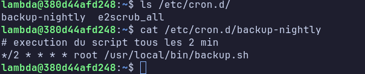
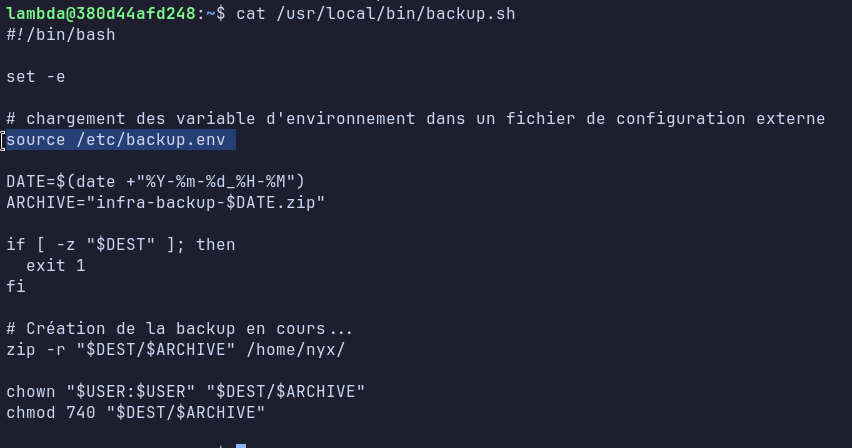
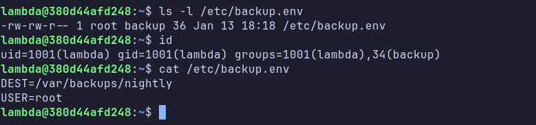
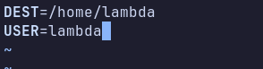
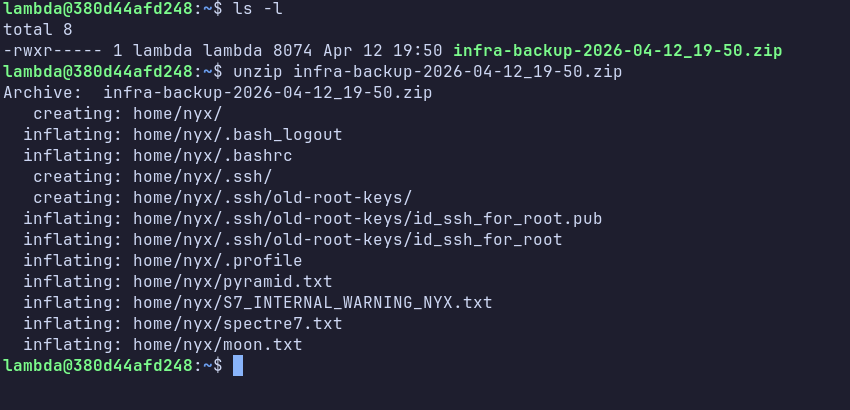
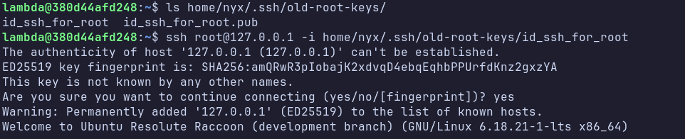
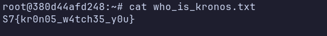

---

# CTF – Spectre 7

---

##  Informations générales

| Champ                | Valeur             |
| -------------------- | ------------------ |
| **Nom du challenge** | Backup to the Root |
| **Auteur**           | lenzzair           |
| **Difficulté**       | Medium             |
| **Code challenge**   | linux1_E3          |

---

## Principe du challenge

- Serveur présenté comme nœud central de backup de Spectre 7
- Utilisateur compromis : nyx
- Erreur humaine : clé SSH root exposée indirectement
- Enchaînement logique :
```
accès user → analyse cron / script de backup / changement de la conf backup / récupération de la backup / clés → root
```
Techniques exploitées

- Mauvaise gestion des backups
- Fichiers sensibles lisibles par un user non privilégié
- Clé SSH root récupérable
- Accès SSH root sans mot de passe
- Aucun exploit kernel









### Éléments importants

Utilisateurs :

- **nyx** 
- **root** (objectif)

Fichiers clés :
```bash
/home/nyx/S7_INTERNAL_WARNING_NYX.txt

/usr/local/bin/backup.sh 

/etc/backup.env

/home/nyx/.ssh/old-root-keys

/root/who_is_kronos.txt → flag final
```
Services :

```bash
SSH

cron
```

## Arborescence projet

```bash
./
├── Dockerfile
├── entrypoint.sh   
├── config/
│   └── backup.env  
├── cron/
│   └── cron-backup
├── file/
│   ├── S7_INTERNAL_WARNING_NYX.txt
│   └── ...
├── script/
│   └── backup.sh
├── flag.txt
└── README.md
```

## Déploiement (Docker)

Prérequis :

- **Docker**


Commandes :

```bash
docker build -t image_backup .
docker run -it --rm -d -p 2222:22 -h central_backup --name key_takeaway image_backup:latest
```

Vérification :

```bash
docker ps
ssh lambda@localhost -p <PORT>
#password: lambda
```


## Variables importantes

- DEST défini dans /etc/backup.env
- USER défini dans /etc/backup.env #permet d'avoir les droits lors du changement du path
- Script de backup exécuté via cron en root

## Flag

Format : `S7{...}`

`S7{kr0n05_w4tch35_y0u}`

Emplacement final :
`/root/who_is_kronos.txt`

