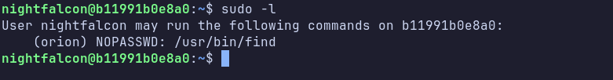
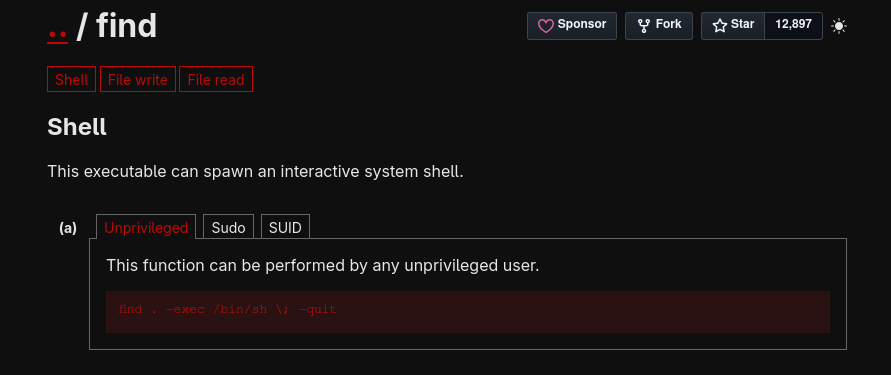
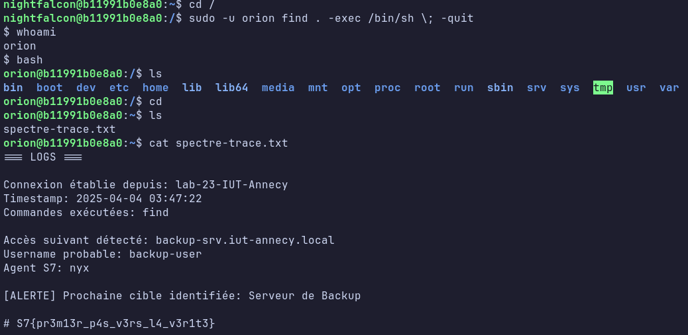

# CTF – Spectre 7  
## Documentation interne du challenge

***

## Informations générales

| Champ                | Valeur |
|----------------------|--------|
| **Nom du challenge** | find your rights |
| **Auteur**           | lenzzair |
| **Difficulté**       | easy |
| **Code challenge**   | LNX1_E1 |

***

## Description du challenge

Challenge d’initiation à l’élévation de privilèges via `sudo -l`, où un droit `NOPASSWD` mal configuré sur `find` permet de passer d’un utilisateur compromis à un compte plus privilégié.  

***

## Création du challenge

Un conteneur Linux minimal est préparé avec un utilisateur `nightfalcon`, une configuration sudo spécifique sur `find` et un flag stocké dans un répertoire accessible uniquement après élévation.  

***

## ⚠️ Problèmes rencontrés

Le principal point de vigilance concerne les erreurs “Permission denied” de `find` selon le répertoire courant, et la nécessité de restreindre sudo à `/usr/bin/find` pour éviter des chemins de résolution non prévus.  
ex : si le répertoire courant lors du lancement de la commande est /home/nightfalcon la commande sera executée avec l'utilisateur orion qui lui n'a pas les droits sur cette espace là.
-> il faut juste aller dans / ou encore /tmp. 
***

## Structure du projet

```text
./
├── Dockerfile
├── files/
│   └── ...
└── README.md
```  

***

## Déploiement interne

Build et lancement via run, puis test de connexion SSH à `nightfalcon` et vérification de `sudo -l`, de l’exploitation avec `find` et de l’accessibilité du flag après élévation.  

```bash 
docker build -t image_linux_sudo .

docker run -it --rm -d -p 2222:22 -h serveur_pro --name linux_sudo image_linux_sudo:latest

ssh nightfalcon@127.0.0.1 -p 2222
```


***

## 🏁 Flag

Format : `S7{...}`, stocké dans `/orion/spectre-trace.txt` avec des permissions restreintes (lecture uniquement par le propriétaire).  
`S7{pr3m13r_p4s_v3rs_l4_v3r1t3}`
***

## Writeup interne (réservé à l’orga)

Le joueur se connecte en SSH, exécute `sudo -l`, repère `/usr/bin/find` en `NOPASSWD` depuis l'user (orion), lance `sudo -u orion find / -exec /bin/bash \; -quit`, confirme le changement d’utilisateur avec `whoami` puis lit le flag dans le répertoire protégé. **Attention** si l'utilisateur est encore dans /home/nightfalcon/ orion lui n'a pas les droits donc le find n'ont plus. Il faut se déplacer dans un dossier tel que `/` ou encore `/tmp`.





