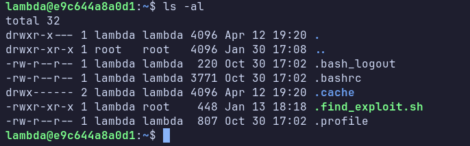
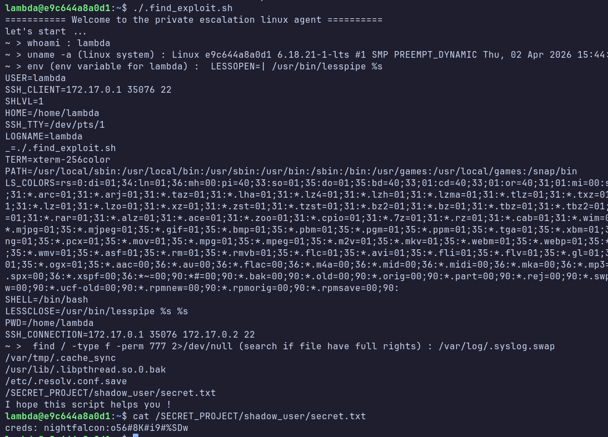
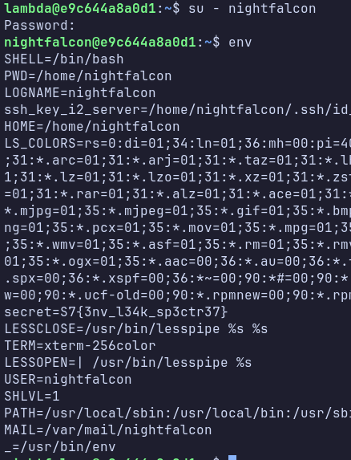

---

# CTF – Spectre 7 - Ghost in the ENV


---

## 📋 Informations générales

| Champ                | Valeur        |
| -------------------- | ------------- |
| **Nom du challenge** | Ghost in the ENV  |
| **Auteur**           | lenzzair      |
| **Difficulté**       | Easy          |
| **Code challenge**   | linux1_E1     |

---

## Description du challenge & scénario

Lors d’une mission de reconnaissance interne, l’équipe sécurité a identifié plusieurs machines virtuelles actives sur l’infrastructure **vSphere** ne correspondant à aucun standard connu.
Ces VM ne sont référencées dans aucun inventaire officiel et semblent appartenir à d’anciens projets internes abandonnés.

L’une de ces machines est accessible via SSH à l’aide d’un **compte générique**.
Ce compte ne devrait permettre que des actions basiques, mais une inspection plus approfondie mérite d'etre faite.


Ce challenge vise à sensibiliser aux mauvaises pratiques de gestion de **fichiers mal protégés**, et aux **fuites de secrets via les variables d’environnement**.

---

## Techniques utilisées

* Accès SSH avec utilisateur générique
* Enumération locale Linux
* Fichiers avec permissions trop permissives (`777`)
* Recherche via `find`
* Mauvaise gestion des identifiants
* Utilisation de `su -` pour charger l’environnement utilisateur
* Fuite de secret via variable d’environnement (`.profile`)
* Gestion des permissions Linux

**Services et ports :**

* SSH (port 22)

**Fichiers importants :**

* `/home/lambda/.find_exploit.sh`
* `/SECRET_PROJECT/shadow_user/secret.txt`
* `/home/nightfalcon/.profile`
* `/home/nightfalcon/.ssh/`

---

##  Création du challenge

Le challenge est construit autour d’un conteneur Docker basé sur Ubuntu

Principales étapes :

* création d’un utilisateur générique (`lambda`) servant de point d’entrée
* création d’un utilisateur interne lié à Spectre7 (`nightfalcon`)
* dissémination volontaire d’identifiants dans un fichier mal protégé
* exposition du flag via une variable d’environnement chargée uniquement lors d’un login shell
* ajout d’un indice scénaristique pour le challenge suivant (clé SSH)

* AIDE : un script déposé dans `/home/lambda/.find_exploit.sh` qui introduit a escalation de privilège et permet de trouver le fichier contenant les creds de nightfalcon.
* AIDE : On peut ajouter une aide payante sur ctfd (Connaissez vous la différence entre su et su -)


---

## Déploiement interne

### Build

```bash
docker build -t chall_linux_env .
```

### Lancement

```bash
docker run -it -d -p 2222:22 --name spectre7_chall_linux_01 chall_linux_env

```
### Connexion au chall

```bash
ssh lambda@<ip-serveur> -p 2222
password: lambda
```

### Vérifications

* Connexion SSH possible avec `lambda`
* Fichier secret accessible via permissions
* Variable d’environnement chargée uniquement avec `su - nightfalcon`
* SSH fonctionnel

---

## Flag

Format du flag : `S7{...}`
Flag :

```
S7{3nv_l34k_sp3ct3e7}
```
---

## Writeup interne

### Cheminement attendu

1. Connexion SSH avec l’utilisateur `lambda`
2. Enumération locale Linux ou utilisation du script
3. Découverte d’un fichier mal protégé 
4. Lecture de `/SECRET_PROJECT/shadow_user/secret.txt`
5. Récupération des identifiants de `nightfalcon`
6. Connexion avec :

   ```bash
   su - nightfalcon
   ```
7. Inspection de l’environnement :

   ```bash
   env
   ```
8. Récupération du flag


### Points d’attention

* Sans `su -`, le flag n’est pas visible
* Certains joueurs peuvent ignorer l’environnement





---

