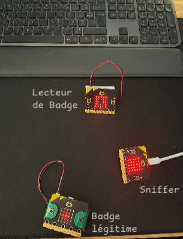
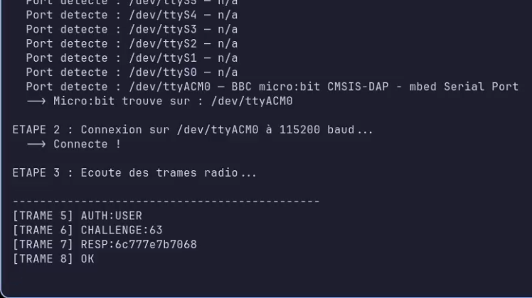
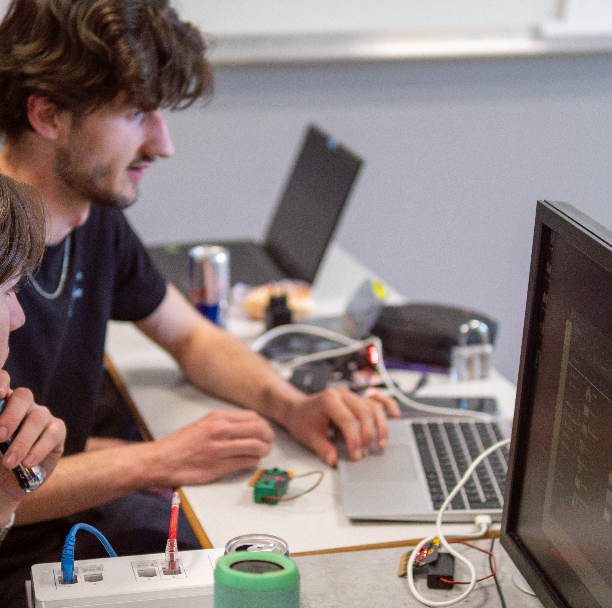

# Spectre 7 — Challenge Hardware Radio

> CTF Challenge — Catégorie : Hardware / Crypto / Prog
> 
> 
> Difficulté : Easy → Medium → Hard
> 

---

## 📸 Aperçu



---

## Concept

Spectre 7 protège ses installations avec un système de badge radio maison.
Ce challenge en 3 étapes progressives demande d'analyser le protocole radio,
de retrouver le secret d'authentification, puis de forger un badge pour
ouvrir la porte et récupérer le flag.

```
Étape 1 — Sniffer les trames radio        [Easy]
Étape 2 — Retrouver le mot de passe       [Medium]
Étape 3 — Ouvrir la porte                 [Hard]
```

---

## Matériel requis

| Matériel | Quantité | Rôle |
| --- | --- | --- |
| micro:bit v2 | 3 | Badge / Lecteur / Sniffer |
| PC fixe | 1 | lecture de trames|
| Câbles USB | 3 | Alimentation et port série |

---

## Étape 1 — Sniffer les trames `[Easy]`

### Objectif

Compléter le firmware du sniffer, le flasher sur un micro:bit
et observer les échanges radio entre le badge et le lecteur.

### Documents distribués

- `script_pc.py` — lecture du port série
- Lien éditeur : https://python.microbit.org

### Ce que le joueur doit compléter/écrire

```python
from microbit import *
import radio

radio.config(channel=7, power=7)
radio.on()

while True:

    trame = radio.receive()

    if trame is not None:

        # Envoi de la trame sur le port série (lisible depuis le PC)
        print(trame)

    sleep(50)
```


### Flag

```
S7{AUTH:USER}
```

---

## Étape 2 — Retrouver le mot de passe `[Medium]`

### Objectif

Analyser les trames interceptées, comprendre le protocole
et retrouver le secret utilisé par le badge grâce aux propriétés
de l'algorithme de chiffrement.

### Documents distribués

- `RFC_S7-001.md` — documentation complète du protocole

Grâce à la RFC et aux trames sniffer, on pouvait retrouver le secret échangé entre le badge et son lecteur

 


https://github.com/user-attachments/assets/9e044fe4-5e4e-4794-bd41-25f31d30ece1


On retrouvait bien **SHADOW** en faisant tout l’échange


> Petite mention aux 1ʳᵉˢ années qui ont fait leur XOR avec un papier crayon bits par bits ça m'a fait chaud au cœur ^^
> PS: la RFC pouvait porter a confusion j'avoue hi hi

### Flag

```
S7{SHADOW}
```

---

## 🚀 Étape 3 — Ouvrir la porte `[Hard]`

### Objectif

Écrire un script micro:bit qui rejoue le protocole d'authentification
en radio avec le bon secret et l’user ADMIN, récupère le flag renvoyé par
le lecteur et le lire sur le PC.

### Flux d'authentification

```
badge  →  AUTH:ADMIN       →  lecteur
badge  ←  CHALLENGE:xx     ←  lecteur
badge  →  RESP:xxxxxxxx    →  lecteur
badge  ←  FLAG:xxxxxxxx    ←  lecteur
  │
  │ port série USB
  ▼
PC → S7{R4D10_PR0T0C0L}
```


### Flag

```
S7{R4D10_PR0T0C0L}
```

---

## 🐛 Problèmes fréquents

| Problème | Solution |
| --- | --- |
| Port série non détecté sur Linux | `sudo usermod -aG uucp $USER` puis reconnexion |
| Pas de trames reçues | Vérifier canal radio = 7 dans le sniffer |
| `DENIED` systématique | Vérifier majuscules : `AUTH:USER` ou `AUTH:ADMIN` |
| Bouton B sans réponse | Vérifier timeout = 5s dans `etape3_badge.py` |

---

## 🔐 Informations secrètes `[ORGA UNIQUEMENT]`

| Info | Valeur |
| --- | --- |
| Mot de passe | `SHADOW` |
| Flag réel | `S7{R4D10_PR0T0C0L}` |
| Canal radio | 7 |

---

## Conclusion

Malgré quelques difficultés à intégrer ce type de challenge dans un CTF, je suis très satisfait de l'accueil qu'il a reçu de la part des étudiants. Je suis particulièrement fier des premières années qui se sont accrochés jusqu'au bout et ont réussi à flagger les 3 étapes.



---

*Spectre 7 CTF — Challenge Hardware Radio*
